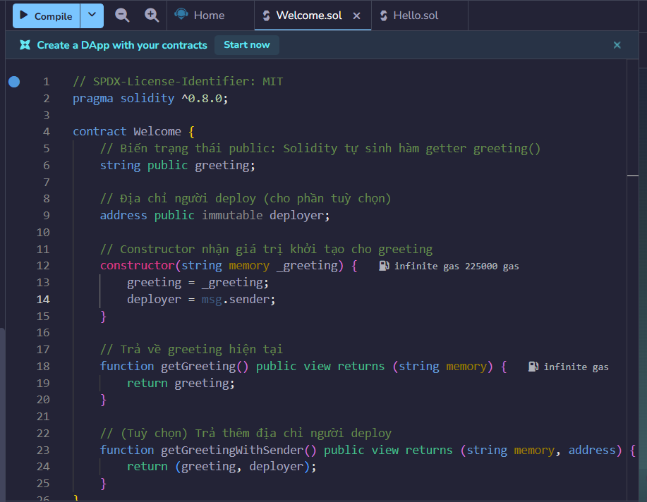
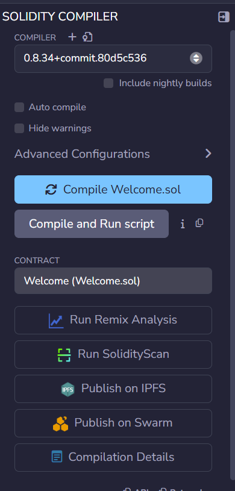
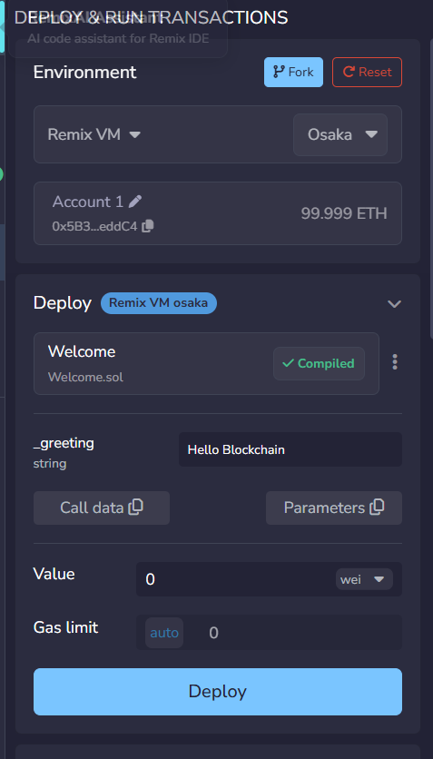
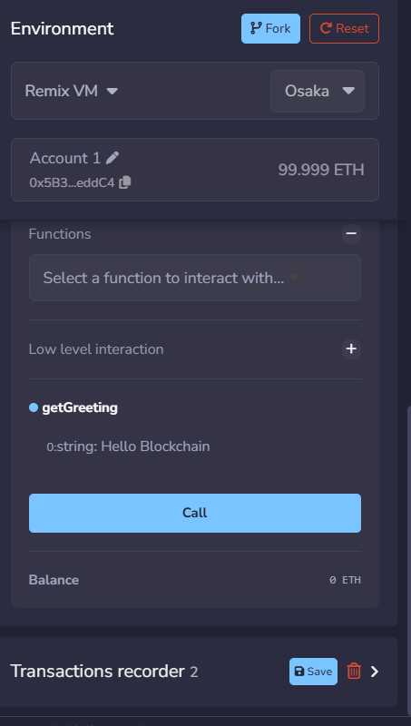
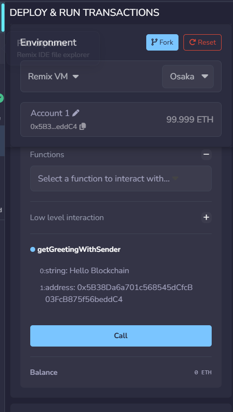

# Bài 2.2 – Viết hàm Solidity đơn giản (Minh chứng)

## 📄 Đề bài
Viết một smart contract tên là `Welcome`:
- Biến `greeting` dạng `string`, khai báo `public`.
- Constructor truyền vào giá trị khởi tạo cho `greeting`.
- Hàm `getGreeting()` trả về `greeting`.

## 📝 Mã nguồn contract

```solidity
// SPDX-License-Identifier: MIT
pragma solidity ^0.8.0;

contract Welcome {
    // Biến trạng thái public: Solidity tự sinh hàm getter greeting()
    string public greeting;

    // Địa chỉ người deploy (cho phần tuỳ chọn)
    address public immutable deployer;

    // Constructor nhận giá trị khởi tạo cho greeting
    constructor(string memory _greeting) {
        greeting = _greeting;
        deployer = msg.sender;
    }

    // Trả về greeting hiện tại
    function getGreeting() public view returns (string memory) {
        return greeting;
    }

    // (Tuỳ chọn) Trả thêm địa chỉ người deploy
    function getGreetingWithSender() public view returns (string memory, address) {
        return (greeting, deployer);
    }
}
```

## ✅ Checklist minh chứng

### 1. Viết contract `Welcome`
- [x] Mở Remix IDE tại https://remix.ethereum.org
- [x] Tạo file `.sol` mới
- [x] Dán mã nguồn contract `Welcome` (biến `greeting` public, constructor khởi tạo, hàm `getGreeting()`)
  


-
### 2. Compile contract
- [x] Chọn compiler phiên bản 0.8.x
- [x] Compile thành công không có lỗi
- 


### 3. Deploy contract
- [x] Chọn environment (Injected Provider hoặc VM)
- [x] Nhập giá trị khởi tạo cho `greeting` (ví dụ: `"Xin chào!"`)
- [x] Nhấn Deploy và đợi giao dịch thành công
- 


### 4. Gọi hàm `getGreeting()`
- [x] Click nút `getGreeting` trong phần Deployed Contracts
- Kiểm tra giá trị trả về đúng với giá trị `greeting` đã khởi tạo

- 


### 5. (Tuỳ chọn) Trả thêm địa chỉ người deploy
- [x] Sửa hàm để trả về thêm địa chỉ `msg.sender`
- [x] Deploy lại và kiểm tra kết quả
- 


## 📷 Các bước kèm theo (nếu cần)
---

## 📝 Ghi chú kết quả
- Contract: `Welcome`
- Compiler:
- Environment:
- Giá trị `greeting` khởi tạo:
- Kết quả `getGreeting()`:
- (`Optional`) Kết quả trả về với `msg.sender`: N/A