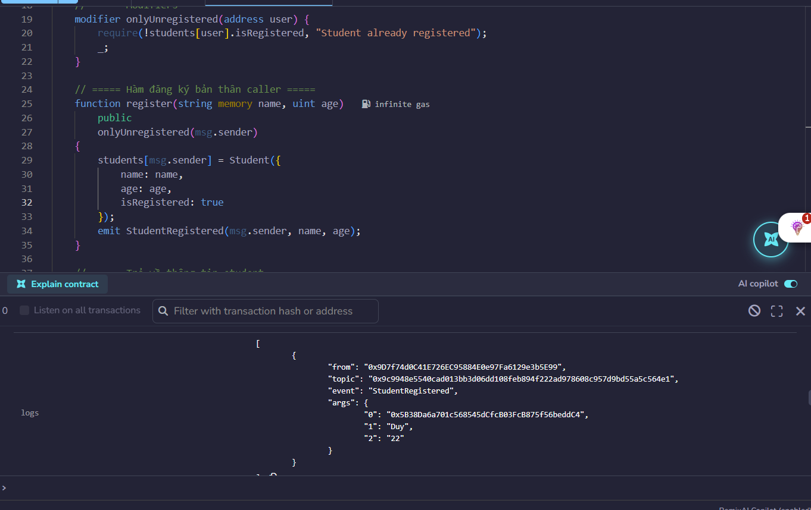
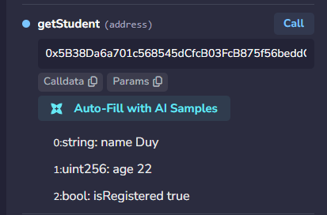
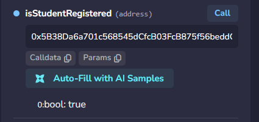

# BÁO CÁO BÀI 4.1 – StudentRegistry (Mapping, Struct, Array)

- **Sinh viên:** ______
- **Ngày:** 03/10/2026
- **Solidity:** `^0.8.29` – Chạy trên: [Remix IDE](https://remix.ethereum.org)
- **File contract:** `contracts/StudentRegistry.sol`

---

## 1. Mục code

> Code mẫu bám sát 100% cấu trúc đề bài: struct `Student`,
> `mapping(address => Student)`, hàm `register()`, `getStudent()`,
> `isStudentRegistered()`.

```solidity
// SPDX-License-Identifier: MIT
pragma solidity ^0.8.29;

contract StudentRegistry {
    // ===== Struct =====
    struct Student {
        string name;       // tên sinh viên
        uint age;          // tuổi
        bool isRegistered; // đã đăng ký hay chưa
    }

    // ===== State variable =====
    mapping(address => Student) public students;

    // ===== Events =====
    event StudentRegistered(address indexed student, string name, uint age);

    // ===== Modifiers =====
    modifier onlyUnregistered(address user) {
        require(!students[user].isRegistered, "Student already registered");
        _;
    }

    // ===== Đăng ký bản thân caller =====
    function register(string memory name, uint age)
        public
        onlyUnregistered(msg.sender)
    {
        students[msg.sender] = Student({
            name: name,
            age: age,
            isRegistered: true
        });
        emit StudentRegistered(msg.sender, name, age);
    }

    // ===== Trả về thông tin student =====
    function getStudent(address user)
        public
        view
        returns (string memory name, uint age, bool isRegistered)
    {
        Student storage s = students[user];
        return (s.name, s.age, s.isRegistered);
    }

    // ===== Kiểm tra đã đăng ký chưa =====
    function isStudentRegistered(address user) public view returns (bool) {
        return students[user].isRegistered;
    }
}
```

---

## 2. Các mục test trên Remix


### 2.1 Test `register()`

**Input:**
name: "Duy", age: 22  

**Ảnh:**

  

### 2.2 Test `getStudent()`

**Input:**


**Ảnh:**


### 2.3 Test `isStudentRegistered()`


**Input:** address User


**Ảnh:**
