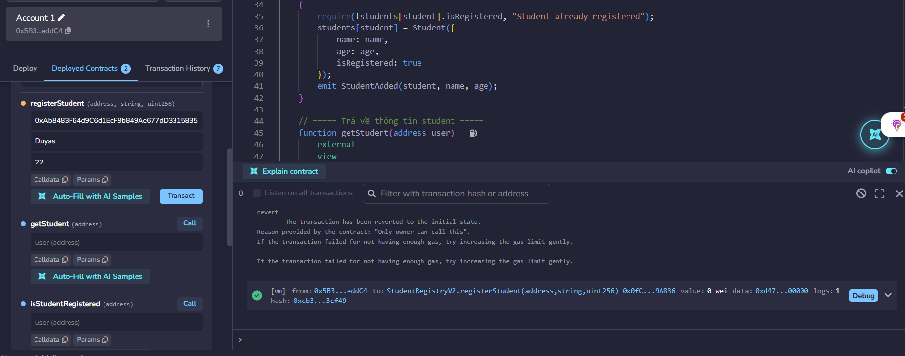
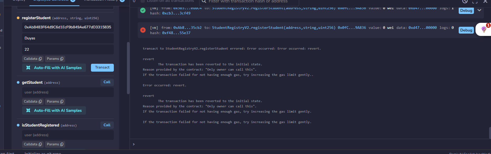
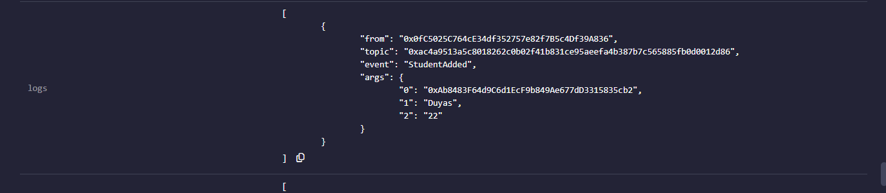
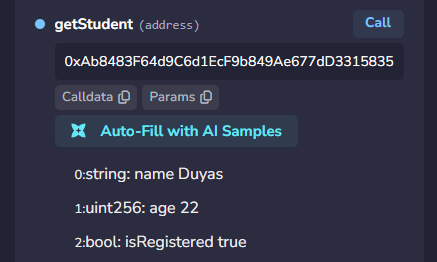
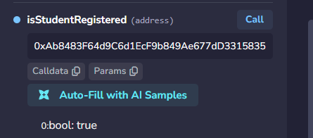

# BÁO CÁO BÀI 4.2 – StudentRegistryV2 (Modifier, Event và Quyền Truy Cập)

- **Sinh viên:** ______
- **Ngày:** 03/10/2026
- **Solidity:** `^0.8.29` – Chạy trên: [Remix IDE](https://remix.ethereum.org)
- **File contract:** `contracts/StudentRegistryV2.sol`

---

## 1. Mục code

> Code mẫu bám sát 100% đề bài: mở rộng từ bài 4.1 – chỉ **owner**
> (người deploy) được thêm sinh viên bằng `registerStudent()`,
> thành công sẽ **emit event**.

```solidity
// SPDX-License-Identifier: MIT
pragma solidity ^0.8.29;

contract StudentRegistryV2 {
    // ===== Struct (mở rộng từ bài 4.1) =====
    struct Student {
        string name;       // tên sinh viên
        uint age;          // tuổi
        bool isRegistered; // đã đăng ký hay chưa
    }

    // ===== State variables =====
    address public owner;                     // người deploy contract
    mapping(address => Student) public students;

    // ===== Events =====
    event StudentAdded(address indexed student, string name, uint age);

    // ===== Modifiers =====
    modifier onlyOwner() {
        require(msg.sender == owner, "Only owner can call this");
        _;
    }

    // ===== Constructor: gán người deploy làm owner =====
    constructor() {
        owner = msg.sender;
    }

    // ===== Chỉ owner thêm sinh viên =====
    function registerStudent(address student, string memory name, uint age)
        external
        onlyOwner
    {
        require(!students[student].isRegistered, "Student already registered");
        students[student] = Student({
            name: name,
            age: age,
            isRegistered: true
        });
        emit StudentAdded(student, name, age);
    }

    // ===== Trả về thông tin student =====
    function getStudent(address user)
        external
        view
        returns (string memory name, uint age, bool isRegistered)
    {
        Student storage s = students[user];
        return (s.name, s.age, s.isRegistered);
    }

    // ===== Kiểm tra đã đăng ký chưa =====
    function isStudentRegistered(address user) external view returns (bool) {
        return students[user].isRegistered;
    }
}
```

---

## 2. Các mục test trên Remix

> 📸 **Chỗ để ảnh:** điền nội dung và dán ảnh chụp Remix (Deploy & Run Transactions / Console) vào đây.
> Lưu ý: chuyển account để test quyền truy cập (Account #0 = owner).

### 2.1 Test `registerStudent()` thành công (gọi từ owner)

**Input:** 
Id owner la Account1

**Ảnh:**


### 2.2 Test `registerStudent()` thất bại (gọi từ account KHÔNG phải owner)

**Input:** 
Chuyen sang Account 2

**Ảnh:**


### 2.3 Test event log `StudentAdded`


**Ảnh:**


### 2.4 Test `getStudent()`


**Ảnh:**


### 2.5 Test `isStudentRegistered()`

**Input:** 
Address

**Ảnh:**

