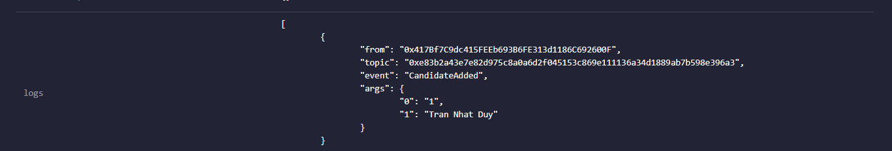
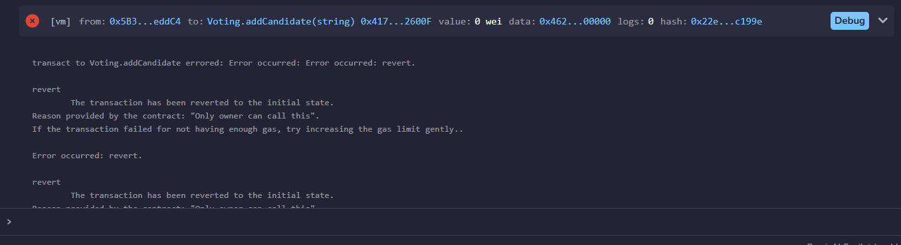
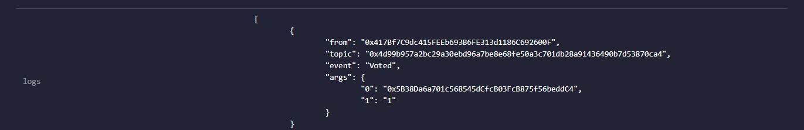
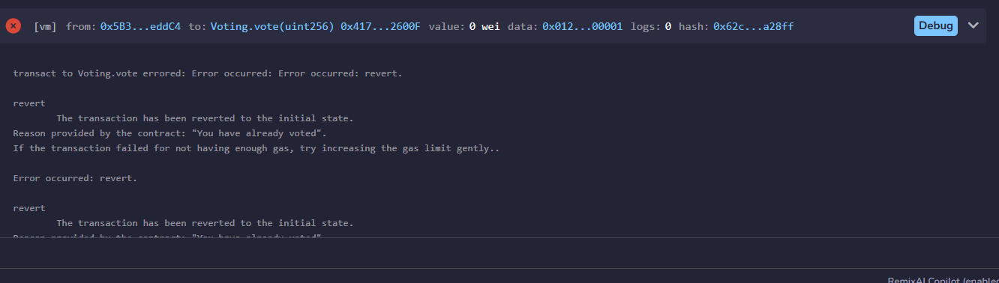
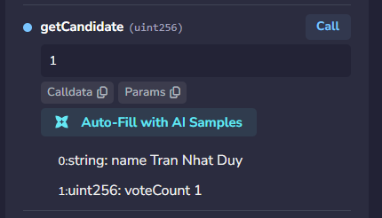

# BÁO CÁO BÀI 4.3 – Voting Smart Contract (Bài tập tổng hợp tuần 4)

- **Sinh viên:** ______
- **Ngày:** 03/10/2026
- **Solidity:** `^0.8.29` – Chạy trên: [Remix IDE](https://remix.ethereum.org)
- **File contract:** `contracts/Voting.sol`

---

## 1. Mục code

> Code mẫu bám sát 100% yêu cầu đề bài:
> 1️⃣ struct `Candidate { name, voteCount }`
> 2️⃣ mapping `candidates(uint => Candidate)`
> 3️⃣ mapping `hasVoted(address => bool)`
> 4️⃣ modifier `onlyOwner` tạo ứng viên
> 5️⃣ event `Voted(address voter, uint candidateId)`

```solidity
// SPDX-License-Identifier: MIT
pragma solidity ^0.8.29;

contract Voting {
    // ===== 1️⃣ Struct Candidate =====
    struct Candidate {
        string name;
        uint voteCount;
    }

    // ===== State variables =====
    address public owner;
    uint public candidateCount; // số ứng viên, đánh số bắt đầu từ 1

    // ===== 2️⃣ Mapping candidates =====
    mapping(uint => Candidate) public candidates;

    // ===== 3️⃣ Mapping hasVoted =====
    mapping(address => bool) public hasVoted;

    // ===== Events =====
    event CandidateAdded(uint indexed candidateId, string name);
    event Voted(address voter, uint candidateId); // 5️⃣

    // ===== 4️⃣ Modifier onlyOwner =====
    modifier onlyOwner() {
        require(msg.sender == owner, "Only owner can call this");
        _;
    }

    // ===== Constructor =====
    constructor() {
        owner = msg.sender;
    }

    // ===== Admin tạo ứng viên =====
    function addCandidate(string memory name) external onlyOwner {
        require(bytes(name).length > 0, "Name must not be empty");
        candidateCount++;
        candidates[candidateCount] = Candidate({name: name, voteCount: 0});
        emit CandidateAdded(candidateCount, name);
    }

    // ===== Người dùng vote (1 lần / người) =====
    function vote(uint candidateId) external {
        require(!hasVoted[msg.sender], "You have already voted");
        require(
            bytes(candidates[candidateId].name).length > 0,
            "Candidate does not exist"
        );

        hasVoted[msg.sender] = true;
        candidates[candidateId].voteCount++;

        emit Voted(msg.sender, candidateId);
    }

    // ===== Đọc số phiếu (kèm getter public của mapping) =====
    function getCandidate(uint candidateId)
        external
        view
        returns (string memory name, uint voteCount)
    {
        Candidate storage c = candidates[candidateId];
        return (c.name, c.voteCount);
    }
}
```

---

## 2. Các mục test trên Remix

> 📸 **Chỗ để ảnh:** điền nội dung và dán ảnh chụp Remix (Deploy & Run Transactions / Console) vào đây.
> Lưu ý: Account #0 = owner/admin, chuyển sang Account #1, #2... để test vote.

### 2.1 Test `addCandidate()` thành công (gọi từ owner)

**Input:**
name : Tran Nhat Duy

**Ảnh:**


### 2.2 Test `addCandidate()` thất bại (gọi từ account KHÔNG phải owner)

**Ảnh:**


### 2.3 Test `vote()` thành công + event log `Voted`

**Input:**

**Ảnh:**


### 2.4 Test `vote()` lần 2 – bị chặn (1 người / 1 phiếu)

**Input:**

**Ảnh:**


### 2.5 Test kết quả đếm phiếu `getCandidate()` / `candidates()`


**Ảnh:**

